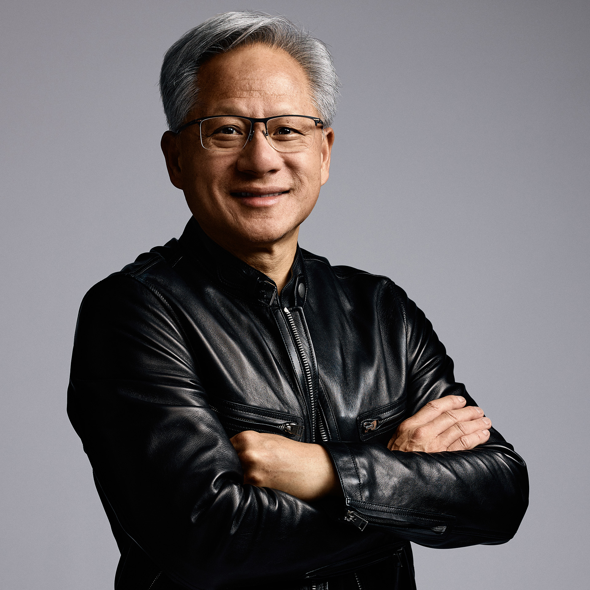

```bash
npx skills add yan-labs/jensen-huang-nvidia-catalyst
```

<p align="center">
  <a href="https://nvidianews.nvidia.com/bios/jensen-huang">
    
  </a>
</p>

# jensen-huang-nvidia-catalyst

[](https://skills.sh/yan-labs/jensen-huang-nvidia-catalyst)

A decision-support skill for tracking **Jensen Huang / Huang Renxun
([NVIDIA](https://www.nvidia.com/))** public dynamics across official NVIDIA
sources, events, interviews, major media, policy headlines, customer/supplier
signals, and market reactions.

This repo turns those public signals into a compact catalyst workflow for:

- NVDA and NVIDIA product-cycle reads;
- AI infrastructure and data-center supply-chain names;
- Blackwell / Rubin / CUDA / networking / robotics themes;
- China/export-control and sovereign-AI policy signals;
- customer capex and supplier capacity clues;
- short-horizon market reaction calibration.

> Not financial advice. Decision-support only. This skill never trades and never
> places, amends, sizes, or cancels orders. It tracks public information and
> public market context only.

## What's in here

| Path | What it is |
|---|---|
| `jensen-huang-nvidia-catalyst/SKILL.md` | The agent skill and routing instructions |
| `jensen-huang-nvidia-catalyst/references/source-map.md` | Official, media, event, social, supplier, customer, and policy source map |
| `jensen-huang-nvidia-catalyst/references/methodology.md` | Signal tiers, market mapping, reliability, and output shape |
| `jensen-huang-nvidia-catalyst/references/track-record.md` | Live catalyst ledger and calibration rules |
| `jensen-huang-nvidia-catalyst/references/maintenance.md` | Scheduled refresh, dedupe, scoring, and commit rules |
| `data/sightings.json` | Public-dynamics archive, deduped by URL/date/title |
| `data/sightings.csv` | Spreadsheet-friendly sightings archive |
| `data/source_stats.txt` | Source counts and last-seen summary |
| `assets/jensen-huang.jpg` | Official NVIDIA Newsroom headshot |

## Use it as a skill

One-command install with [skills.sh](https://skills.sh/):

```bash
npx skills add yan-labs/jensen-huang-nvidia-catalyst
```

It triggers on Jensen Huang, Huang Renxun, 黄仁勋, NVIDIA CEO, NVDA, Blackwell,
Rubin, CUDA, GPU export controls, sovereign AI, AI factories, DGX, GB200/GB300,
NVL, Spectrum-X, InfiniBand, robotics, HBM, TSMC capacity, and questions about
whether a Jensen/NVIDIA public signal can move NVDA or AI-infrastructure stocks.

## Maintenance

The scheduled maintainer should search official NVIDIA sources first, then major
news and trade-press sources, dedupe against `data/sightings.json`, classify
market-relevant items with `references/methodology.md`, and update the live
ledger in `references/track-record.md` only when a signal has a tradable market
read or a useful calibration outcome.

This repository contains public information, public links, and derived analysis.
It is independent research infrastructure and is not affiliated with, endorsed
by, or connected to NVIDIA or Jensen Huang.

